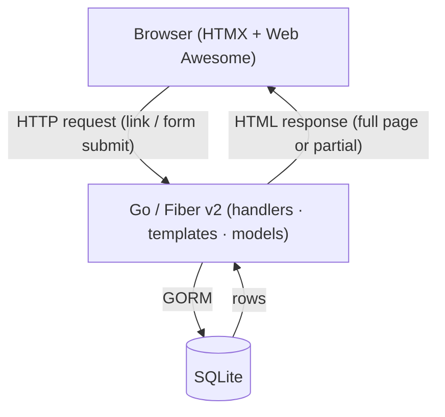

# Pockets — Personal Finance Tracker

This project is for exploring and validating a **spec-driven development** workflow with Claude Code. Features are designed through a structured `/spec` → `/dev` pipeline before any code is written.

## Application

Pockets is a personal finance tracker with multi-currency support, account spaces, recurring costs, and AI-assisted categorization. It is built as a **hypermedia-driven application**: the server renders all HTML, and the browser stays thin. HTMX handles dynamic interactions through partial page swaps — no client-side router, no JSON API, no JavaScript framework.

---

## Tech Stack

| Layer           | Technology                  | Version        |
| --------------- | --------------------------- | -------------- |
| Language        | Go                          | 1.25.4         |
| Web Framework   | Fiber v2                    | v2.52.11       |
| Template Engine | Go HTML templates (html/v2) | v2.1.3         |
| ORM             | GORM                        | v1.31.1        |
| Database        | SQLite (mattn/go-sqlite3)   | v1.14.22       |
| Hypermedia      | HTMX                        | 2.0.4          |
| UI Components   | Web Awesome                 | 2.0.0-alpha.10 |
| E2E Testing     | Playwright                  | latest         |

---

## Architecture



### Key design decisions

- **Server-side rendering** — every response is HTML. Full pages use `c.Render("template", fiber.Map{})`. HTMX partials return HTML fragments.
- **Hypermedia-driven** — interactions are expressed as links and forms. HTMX attributes (`hx-get`, `hx-post`, `hx-target`, `hx-swap`) enhance them with partial updates without a client-side router.
- **No JavaScript framework** — Web Awesome provides accessible UI components as native custom elements. HTMX handles all dynamic behaviour.
- **SQLite** — single-file database, zero infrastructure. Sufficient for a personal finance tool.

---

## Project Structure

```
finances/
├── cmd/finances/main.go        # Thin entry point
├── internal/
│   ├── config/config.go        # Typed config with defaults
│   ├── db/db.go                # GORM initialization
│   ├── handlers/               # Route handlers (one file per domain)
│   └── models/                 # GORM model structs
├── views/
│   ├── *.html                  # Full page templates
│   └── partials/               # HTMX partial templates
├── e2e/                        # Playwright E2E tests
├── spec/                       # Brainstorms, specs, and progress logs
│   ├── roadmap.md
│   ├── {n}_{summary}_brainstorm.md
│   ├── {n}_{summary}_spec.md
│   └── {n}_{summary}_progress.md
├── reports/                    # Change reports per implementation
└── docs/                       # Architecture decision records
```

---

## Running the App

```bash
go run ./cmd/finances
# Visit http://localhost:3000
```

---

## Roadmap

| #   | Feature                                          | Status      |
| --- | ------------------------------------------------ | ----------- |
| 1   | Authentication (passwordless magic link, JWT)    | Implemented |
| 2   | Multi-Currency with Money Pattern                | Implemented |
| 3   | Multi-Tenancy (per-user data isolation)          | Implemented |
| 4   | Manual Transaction Tracking                      | Implemented |
| 5   | Account Spaces (named, colored)                  | Planned     |
| 6   | Fix Costs (recurring expenses)                   | Planned     |
| 7   | Transaction Categorization (lazy + LLM-assisted) | Planned     |
| 8   | Dashboard & Reporting                            | Planned     |
| 9   | CSV Export                                       | Planned     |
| 10  | User Audit Log                                   | Planned     |
